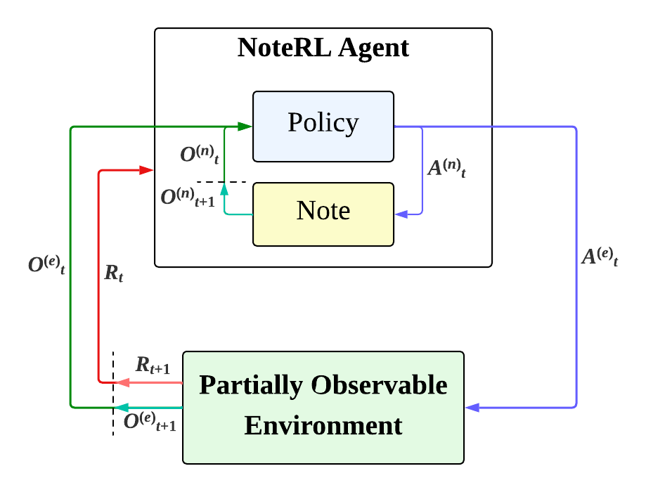

# NoteRL

A Deep RL agent that solves POMDPs by writing to an external "note" array at each timestep. The note is concatenated to the observation, giving the agent persistent working memory without recurrent layers.

Agents produce 2 separate outputs, $A^{(e)}$ for environment action and $A^{(n)}_t$ for "writing" a note. The observation is a concatenation of the environment observation and the note content: $O_t = (O^{(e)}_t, O^{(n)}_t)$.



## Project Structure

```
NoteRL/
├── agents/
│   ├── ppo.py              # PPO agent (classic, note, blend-gate, overwrite-gate variants)
│   └── reinforce.py        # REINFORCE agent (classic, note variants)
├── envs/
│   ├── partial_obs_cartpole.py   # CartPole with velocity observations hidden
│   └── minigrid_flat.py          # Minigrid-Memory with flattened & simplified observation
├── configs/
│   ├── cartpole-partial/   # Configs for CartPole-v1-partial
│   └── minigrid-memory/    # Configs for MiniGrid-MemoryS7-v0
├── scripts/
│   ├── train.py            # Train a single agent
│   ├── train.ps1           # Batch-train all configs (parallel jobs)
│   ├── evaluate.py         # Evaluate saved model checkpoints
│   ├── play.py             # Interactive playback of a trained model
│   ├── plot.py             # Plot training curves
│   ├── plot_runs.py        # Plot multiple training runs
│   └── run_all.ps1         # Full pipeline: train → evaluate → plot
└── models/                 # Saved checkpoints
```

## Setup

**Requirements:** Python 3.10+

```bash
python -m venv .venv
.\.venv\Scripts\activate        # Windows
# source .venv/bin/activate     # macOS/Linux

pip install -r requirements.txt
```

## Training

```bash
python scripts/train.py --config configs/cartpole-partial/ppo_note.yaml --save models/cartpole-partial/[model name].pth --n_episodes 4000
```

| Argument | Required | Description |
|---|---|---|
| `--config` | Yes | Path to a YAML config file |
| `--save` | Yes | Path to save the trained model |
| `--n_episodes` | No | Number of training episodes (default: 1000) |
| `--no_plot` | No | Disable the live training plot |
### Custom config

Copy any existing config and edit `agent_params`. The `env` field accepts:
- `CartPole-v1-partial` — cart position + pole angle only (POMDP)
- `CartPole-v1` — full observations
- Any Minigrid env ID (`MiniGrid-MemoryS7-v0` is the only one tested and used)

## Playing

```bash
python scripts/play.py --model models/cartpole-partial/[model name].pth --env CartPole-v1-partial
```

| Argument | Required | Description |
|---|---|---|
| `--model` | Yes | Path to a trained checkpoint (`.pth`) |
| `--env` | Yes | Environment name (e.g. `CartPole-v1-partial`, `MiniGrid-MemoryS7-v0`) |
| `--n_episodes` | No | Number of episodes to run (default: 10) |
| `--no_render` | No | Disable the renderer (faster evaluation) |

## Full pipeline

`run_all.ps1` trains all configs, evaluates the saved checkpoints, and produces plots in one command:

```powershell
.\scripts\run_all.ps1                        # all environments, running this could easily take over 12 hours depending on hardware!
.\scripts\run_all.ps1 -Env cartpole-partial  # single environment
.\scripts\run_all.ps1 -SkipTraining          # evaluate + plot only
```

| Parameter | Default | Description |
|---|---|---|
| `-Env` | *(all)* | Limit to one environment sub-directory |
| `-Episodes` | 4000 | Training episodes per run |
| `-NumAgents` | 5 | Parallel runs per config |
| `-EvalEpisodes` | 50 | Evaluation episodes per saved model |
| `-PlotsDir` | `plots` | Output directory for plots and eval results |
| `-SkipTraining` | false | Skip Phase A and go straight to evaluate + plot |

## Loading a trained model

Checkpoints saved by `train.py` include the full config, so no need to re-specify hyperparameters:

```python
from agents.ppo import PPOAgent

agent = PPOAgent.from_checkpoint('models/ppo_note.pth', device='cpu')
```

